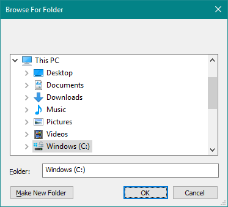
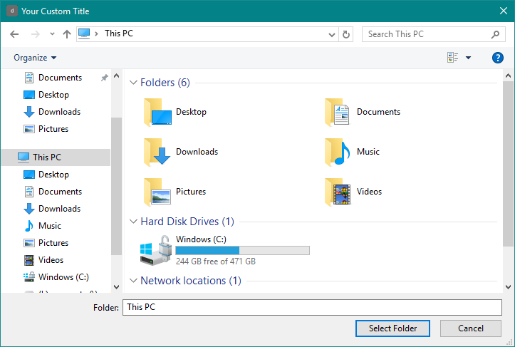
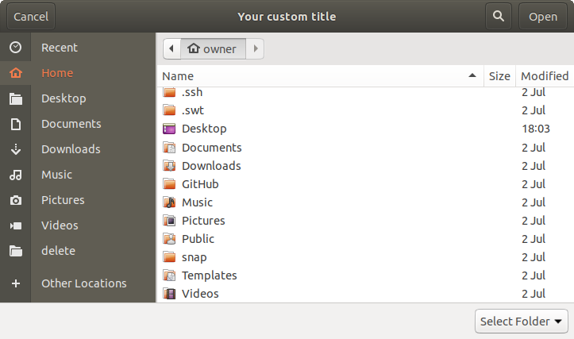

# nw-programmatic-folder-select


Programmatically open a native "Folder select" dialog in NW.js.

Similar to `<input type="file" nwdirectory>` but with just JavaScript.





Compatible with all versions of NW.js.

**Version** | **Tested**
:--:        | :--:
v0.12.3     | :heavy_check_mark:
v0.14.7     | :heavy_check_mark:
v0.40.0     | :heavy_check_mark:


## Installation

```
npm install --save nw-programmatic-folder-select
```


## Basic Usage

```js
const openFolderExplorer = require('nw-programmatic-folder-select');
// The window object, to have access to the browser context, and a callback function with the user's choice
openFolderExplorer(window, (selection) => { console.log(selection); });
```


## Advanced Usage

```js
const openFolderExplorer = require('nw-programmatic-folder-select');

const options = {
  // Optional string. The working directory to start in
  directory: 'C:\\',
  // Optional string. A custom title for the OS's folder selection dialog
  title: 'Select a folder to store the settings file in'
};

// Optional asynchronous callback function.
// Returns a string to the path, like 'C:\Users\Bob\Desktop', or undefined if no selection made
const callback = function (selection) {
  if (selection) {
    console.log('The user chose ' + selection);
  } else {
    console.log('The user cancelled the dialog.');
  }
}

// Window is required to have access to the browser context
// All other arguments are optional
openFolderExplorer(window, options, callback);
```
